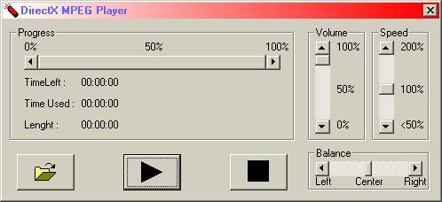



## DirectX Media Player \(\*\.wav, \*\.mp2, \*\.mp3, \*\.bmp, \*\.jpg, \*\.mpg, \*\.avi \*\.mid\)

### Description

This is a simple media player application suports all types that you computer can play it actually search for a render device.

Well i can play all files i want (Even mpg and avi a small window pops up with the screen).

It usses 'Quartz DLL' that belongs to DirectX (don't get mad if this is not the case :P).

So actually its a DirectX mp3 player well atleast thats where i builded this project for but it came out that it olmost renders all atm it renders : *.wav, *.mp2, *.mp3, *.bmp, *.jpg, *.mpg, *.avi *.mid

Hope you find this use full. :-P
 
### More Info
 

             |
---                |---
**Submitted On**   |2001-08-16 20:49:30
**By**             |[egbert](https://github.com/Planet-Source-Code/PSCIndex/blob/master/ByAuthor/egbert.md)
**Level**          |Intermediate
**User Rating**    |4.4 (22 globes from 5 users)
**Compatibility**  |VB 5\.0, VB 6\.0
**Category**       |[DirectX](https://github.com/Planet-Source-Code/PSCIndex/blob/master/ByCategory/directx__1-44.md)
**World**          |[Visual Basic](https://github.com/Planet-Source-Code/PSCIndex/blob/master/ByWorld/visual-basic.md)
**Archive File**   |[DirectX Me248288172001\.zip](https://github.com/Planet-Source-Code/egbert-directx-media-player-wav-mp2-mp3-bmp-jpg-mpg-avi-mid__1-26304/archive/master.zip)

